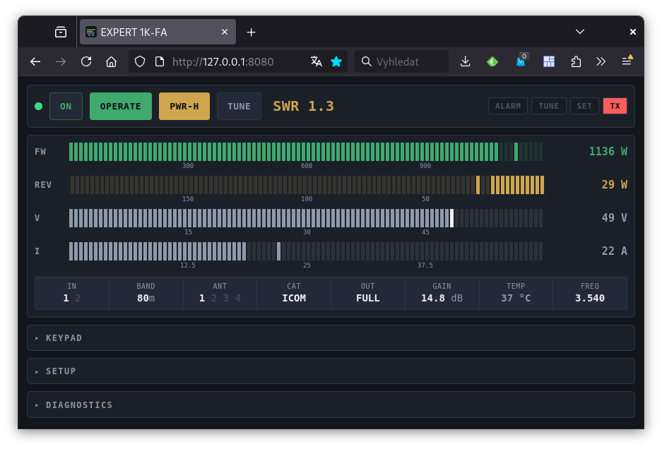

# EXPERT 1K-FA — Web Console

A web replacement for `Expert_Console2.exe`, the Windows console for the SPE
EXPERT 1K-FA linear amplifier — usable from a remote QTH. A small daemon owns
the serial port and serves its own page; all protocol knowledge lives in
`index.html`.

---

## Quick start

Install the only dependency (needed for live operation only):

    apt install python3-serial

Try it without any hardware — the simulator answers keystrokes and streams
plausible telemetry:

    ./expert_console.py --simulate

Then open <http://127.0.0.1:8080/>.

Run it against the amplifier:

    ./expert_console.py --port /dev/ttyUSB.pa --raw-port 7373 --listen 0.0.0.0

Press **ON** in the top row and wait roughly seven seconds — the amplifier
raises DTR, boots, and the watchdog restarts the telemetry stream by itself.

Three things worth knowing before you start:

- Without `--listen 0.0.0.0` the console is reachable only from the machine
  itself. This applies to `--raw-port` as well.
- The serial port is opened **exclusively**. If `ser2net` still holds it, the
  daemon says so instead of quietly fighting over the bytes.
- Nothing on screen? Open **Diagnostics** and read `RX bytes` — see
  [Troubleshooting](#troubleshooting).

If the amplifier does not answer at all, this splits the problem into "is the
port taken", "does DTR switch" and "does the amplifier reply":

    sudo ./test/diag-serial.py /dev/ttyUSB.pa

---

## How it fits together

    browser ──http──► expert_console.py ──► /dev/ttyUSB.pa ──► 1K-FA
                      (HTML + SSE + serial)      9600 8N1

The daemon is deliberately thin: serial port, DTR, HTTP, and passing bytes
through. Framing, checksums, the 30-byte status record and the setup menus are
all decoded in the browser.

## Running the original Windows console under wine

`expert-console.sh` launches the original `Expert_Console2.exe` under wine. It
serves as the **reference implementation** — useful whenever you are unsure
whether the web console is reading something correctly.

    ./expert-console.sh                 # normal run
    DEBUG=1 ./expert-console.sh         # plus a hex dump to /tmp/expert1k.log

The script bridges TCP to a PTY with `socat`, links it to `COM1` inside wine and
starts the application. It points at `192.168.1.201:7373`, which is what our
daemon's `--raw-port 7373` serves — so it keeps working **unchanged** after you
retire ser2net.

With `DEBUG=1` you get paired ground truth: the bytes in the log, and the
reference interpretation of those same bytes on screen. That is exactly how the
decoder in this project was verified.

> The script hard-codes `EXE=/home/dan/inst/Expert_Console2.exe`, and wine
> rewrites `dosdevices/com1` on startup — hence the ordering inside: first
> `wineserver -p`, only then the symlink.

## Why ser2net had to go

Because of **DTR**. ser2net raises it when a client connects and leaves it
there, which controls the amplifier's power as a side effect you cannot steer.

**DTR is a level switch, not an ignition pulse.** Measured on the bench first:

    1000 ms pulse, then DTR low  →  nothing for 45 s
    DTR held high                →  reply after 6.7 s

Protocol **Rev. 2.0** then confirmed it in as many words (p. 4): turning on is
*"simply raising it at a voltage level greater than +5 Vdc"* and takes **3 to
4.5 seconds**; turning off means *"this control line has to be reset in its OFF
state"*, about a second, because the state is sampled for at least 500 ms.

    DTR high = amplifier running          DTR low = off

After power-up the amplifier resets `RCU` to `OFF`, so telemetry only resumes
once the browser's watchdog sends `RCU_ON` again. It retries every 1.5 s, so
waiting is enough.

The port is opened **exclusively** (`TIOCEXCL`). Without that, pyserial happily
opens a port ser2net already holds; both then read from the same device and the
incoming bytes are split between them at random — which looks exactly like
"writes go out, nothing comes back".

If a different unit behaves the way Rev. 1.0 describes, use `--dtr-mode pulse`.

> ⚠️ Closing the port drops DTR, so **restarting or crashing the daemon turns
> the amplifier off**. That is the safe direction to fail in, but be aware of it
> when restarting during operation. `--dtr-on-start` brings it back up with the
> daemon.

## Two protocol revisions

Both are supported and told apart by `STATUS_CODE` — there is nothing to
configure, and the active revision is shown in Diagnostics.

| | Rev. 1.0 | Rev. 2.0 |
|---|---|---|
| firmware | `06_11_06_x` | `>= 07_07_07_M` (*Second Series*) |
| `STATUS_CODE` | `0x80` | `0xA0` / `0xA1` (bit 0 = startup mode) |
| `FLAGS` bit 7 | `PA_PROT` | `T_SCALE` (1 = °C, 0 = °F) |
| CAT list | 6 entries | +TEN-TEC, +FLEX-RADIO → `RS-232` 4→6, `NONE` 5→7 |
| `SETUP OPTIONS` | `0x07`, 7 items | `0x06`, 9 items (+START, +TEMP.) |
| `SET ANTENNA` | `0x08`, 1 antenna/band | `0x07`, **2 antennas/band**, index in `SETUP_0` |
| `SET TEN-TEC` | — | `0x0B` |
| antennas × bands | `0x05` | dropped (`0x05` = `DATA STORED!`) |

The whole `DISPLAY_CTX` map **shifted by one** from `0x05` upwards.

## Controls

The top row shows **state, not action** — clicking toggles it. `OPERATE` and
`PWR-H` are drawn inverted (filled), because those are the states in which the
amplifier is actually working. Next to them sits the calculated `SWR`, visible
only while transmitting and for a moment afterwards.

| Button | Code | | Button | Code |
|---|---|---|---|---|
| `ON` / `OFF` | *DTR high / low* | | `←L` `L→` `←C` `C→` | 0x30–0x33 |
| `STANDBY` / `OPERATE` | 0x1C | | `IN` `←BAND` `BAND→` | 0x28–0x2A |
| `PWR-L` / `PWR-H` | 0x1A | | `ANT` `CAT` | 0x2B, 0x2C |
| `TUNE` | 0x34 | | `←` `→` `SET` | 0x2D–0x2F |
| | | | `DISPLAY` | 0x1B |

> Both revisions list `0x33` as `L+`, the same as `0x31`. Going by the keyboard
> layout (`0x32` is `C-`) it is really `C+` — the error persists through both
> documents.

### Bar graphs

Each bar is built from LED segments on a fixed 7 px pitch (5 px lit, 2 px gap).
Narrowing the window reduces their number rather than their size, and the unlit
segments stay visible so the full span is always readable.

- the **number beside the bar** shows the **peak**, refreshed slowly enough to
  be legible; the bar itself carries the instantaneous value
- `FW`, `REV` and `I` hold the maximum, **`V` holds the minimum** — with supply
  voltage the interesting figure is the sag under load, not the open-circuit
  reading
- a peak is drawn as a lit segment above the illuminated part, a dip as a
  **bright notch** inside it
- ranges follow the mode: `FW` is 1200 W in FULL, 600 W in HALF, and switches to
  the exciter range in STANDBY
- `SWR` is calculated from forward and reflected power — in OPERATE the
  amplifier does not send it, bytes 23–24 carry gain instead

Temperature is coloured by the fan switching thresholds (manual §18.17) and
honours both CONTEST mode and the °F setting:

    CONTEST off:  <40 grey · 40 green · 65 yellow · 75 sand · 90 red
    CONTEST on:   first stage always running, second from 60, third from 70

## Setup tree

The menu is a state machine **inside the amplifier**. There is no "set the
antenna for 20 m to #2" command — only `SET` / `←` / `→`, plus reading back
where it currently is. So clicking a node cannot jump anywhere; it has to **walk
there**, in a closed loop:

    send ONE key → wait for the next STATUS packet to confirm → then the next

If the amplifier does not follow within a few attempts, the walk stops and says
so. It never drums blind keystrokes into a kilowatt amplifier.

Where selecting an item *is* the value (`SET CAT`, `SET YAESU/ICOM/TEN-TEC`,
`SET BAUDRATE`), that maps onto a drop-down: choose, then *Apply*.
`MANUAL TUNE` and `BACKLIGHT` get +/− buttons, `SET ANTENNA` clickable bands.

> The route into `SET BAUDRATE` is not documented in the specification, so the
> walker will not enter it — the manual arrows still work.

## Losing the address bar and tabs

**1. Application mode — works immediately, nothing to prepare:**

    google-chrome --app=http://192.168.1.201:8080/
    firefox       --kiosk http://192.168.1.201:8080/

**2. Full screen — `F11`.**

**3. Install as an app.** The console serves `manifest.webmanifest` and an icon,
but Chrome only offers installation over **HTTPS or from localhost**. Once
Apache with a certificate sits in front of the daemon, it starts working on its
own. On **iOS**, *Share → Add to Home Screen* works over plain HTTP too.

## Deployment

    [Service]
    ExecStart=/opt/expert/expert_console.py --port /dev/ttyUSB.pa \
              --raw-port 7373 --listen 127.0.0.1 --http-port 8080
    Restart=always
    User=dan

Apache as a reverse proxy when you need HTTPS and a password from outside. SSE
does not need `mod_proxy_wstunnel`:

    <Location /expert>
      AuthType Basic
      AuthUserFile /etc/apache2/.htpasswd
      Require valid-user
      ProxyPass        http://127.0.0.1:8080/
      ProxyPassReverse http://127.0.0.1:8080/
      SetEnv proxy-sendchunked 1
    </Location>

### Migrating from ser2net

1. `systemctl stop ser2net && systemctl disable ser2net`
2. Start the daemon with `--port` and `--raw-port 7373`
3. `expert-console.sh` keeps working unchanged

## Troubleshooting

**The console is empty, no data arriving.** Open Diagnostics and look at
`RX bytes`. Rising while `Frames OK` stays at zero means bytes are arriving but
falling apart — wrong speed, interference, or a shared port. Zero means nothing
is coming off the serial line at all. Frames that cannot be decoded are printed
in full hex.

**The port is busy.** `sudo fuser -v /dev/ttyUSB.pa` and
`systemctl status ser2net`.

**`SET`, `BAND`, `ANT`, `CAT` and `IN` do nothing while `OPERATE` and `MODE`
work.** The amplifier sees `TX` and locks everything that would move the RF path
while transmitting. The console warns about this once `TX` with zero drive power
has persisted for more than two seconds. The usual cause is **a powered-off
transceiver holding PTT**.

**Key probe** in Diagnostics: sends a key, watches the state and reports what
moved. `Hold` sends it 8 times a second for 1.5 s — both revisions give 8/s as
the ceiling for the link.

## Verifying against the hardware

1. With `--auto-shutdown 0` and the amplifier already on: the readings and bars
   must match the front panel, and the `RCU_ON` watchdog must keep the stream up.
2. `ON` from the web raises DTR → the PA comes up in about 7 s.
3. `OFF` from the web drops DTR → the PA shuts down.
4. Confirm that `0x33` is `C+` and not `L+`, by comparison with the original.
5. `TUNE` and `OPERATE` last, into a load.

## Tests

    ./test/run.sh          # decoder and rendering, no hardware needed
    ./test/run.sh --e2e    # plus end-to-end against the simulator

`decode.test.js` and `render.test.js` run **code extracted from `index.html`**
rather than a copy of it, so what gets tested is what actually ships.
`render.test.js` uses a minimal DOM shim, which lets the rendering logic and the
setup-tree walker be verified without a browser. `bundle.py` builds a standalone
copy in a temporary directory and checks that it really runs with no
`index.html` in sight.

## Single-file distribution

`expert_console.py` always reads `index.html` from beside itself, so during
development you edit the HTML and press F5. There is exactly one copy of the
page, and nothing to keep in sync.

When you need one file to drop on another machine:

    ./expert_console.py --bundle expert-standalone.py

That writes a standalone copy with the page folded in — it runs anywhere with
no companion files. The bundle is a build artifact, not a source: it is
gitignored, and running `--bundle` on a bundle is refused.

> Earlier versions folded the page back into `expert_console.py` itself. That
> left two copies of the same content, doubling every GUI change in the history
> and drifting apart whenever the step was forgotten.

## Options

| Option | Default | Meaning |
|---|---|---|
| `--port` | — | serial port, e.g. `/dev/ttyUSB.pa` |
| `--simulate` | — | synthetic amplifier (`--scenario normal\|alarm\|hot`) |
| `--replay FILE` | — | replay a `socat -x -v` capture |
| `--record FILE` | — | write traffic to a file |
| `--listen` | `127.0.0.1` | bind address for both HTTP and the raw port |
| `--http-port` | `8080` | console port |
| `--raw-port` | off | raw TCP for the original application |
| `--auto-shutdown` | `0` | power down after N minutes with no client |
| `--dtr-mode` | `level` | `level` = DTR high means on; `pulse` = ignition pulse |
| `--dtr-on-start` | off | power the amplifier up as the daemon starts |
| `--dtr-pulse-ms` | `1000` | pulse length, `--dtr-mode pulse` only |
| `--bundle FILE` | — | write a standalone copy with the page folded in, then exit |

## Scope

Out of scope: `CAT_232` tuning, server-side telemetry logging, multiple
amplifiers.

## Sources

- `EXPERT_1K-FA_RS232_PROTOCOL_2.pdf` — protocol **Rev. 2.0**, covering the
  *CE/FCC Compliant Second Series* with firmware `>= 07_07_07_M`
- `expert_manual_v20.pdf` — user's manual (§18.17 has the fan thresholds)
- `expert-console.sh` + `Expert_Console2.exe` — the original console under wine

Support for **Rev. 1.0** (firmware `06_11_06_x`) is kept in the code, but its
specification is not in this repository — it can be downloaded from
`linear-amplifier.com`, as the opening notice in Rev. 2.0 points out.
